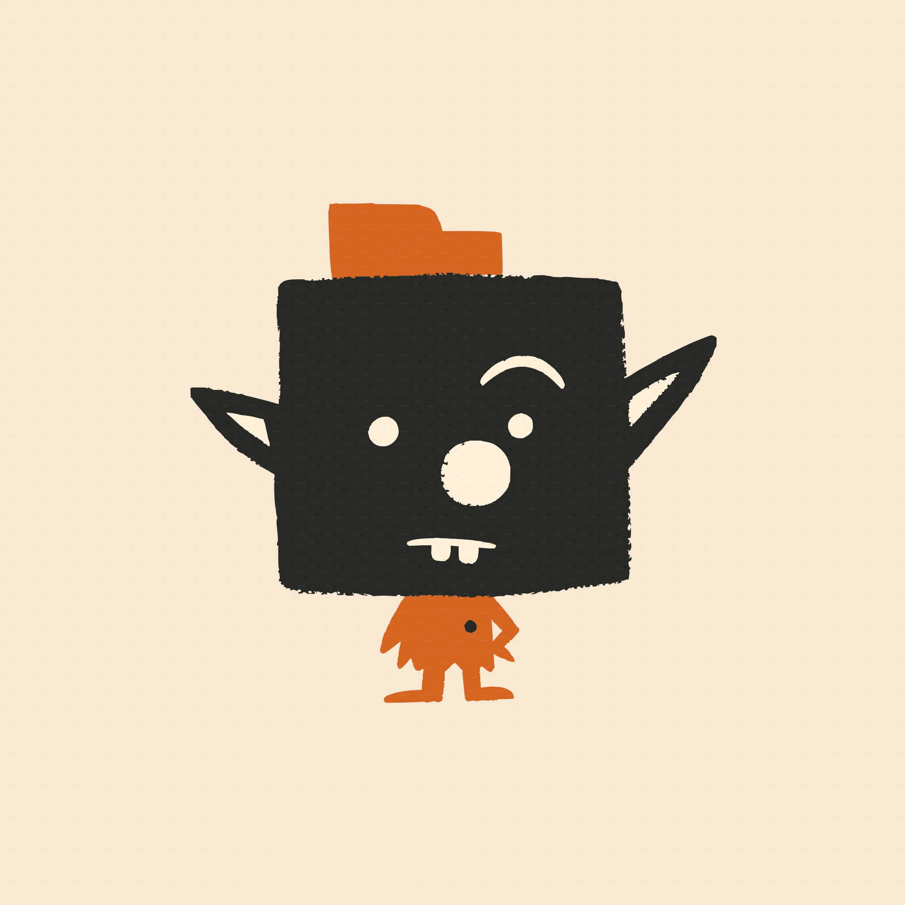

<p align="center">
  
</p>

<h1 align="center">Debrute</h1>

<p align="center"><a href="./README.zh-CN.md">中文版</a></p>

Debrute is a project-scale local visual workbench for you and your AI agent.

Open a real project folder and see its images, video, audio, and text together on one responsive Canvas. Arrange and compare large working sets, edit text in context, leave precise Feedback, and let your agent continue with any tools it already has.

## See The Whole Project

A Debrute Project is an existing local folder. Its files remain ordinary files, its folder hierarchy becomes the Canvas hierarchy, and changes made by agents, scripts, creative software, or the user appear in the same project view.

Every regular file and directory belongs to the Canvas. Supported media and text formats receive rich previews and controls; other files remain visible as part of the project rather than disappearing from its context.

## Work At Project Scale

Use the Canvas to spread out references, prompts, drafts, alternatives, and final assets. Move between the shape of the whole project and individual details without opening files one by one.

The rendering system is designed for large working sets. Spatial indexes, viewport culling, incremental presentation updates, and interaction-aware preview scheduling keep pan, zoom, layout, and comparison responsive as the project grows.

## Keep Every Kind Of Context Visible

- **Images** — view and compare common raster and vector formats.
- **Video** — preview, play, seek, and keep the selected frame with the Canvas.
- **Audio** — play project audio directly beside its related files.
- **Text** — preview and edit briefs, prompts, Markdown, structured data, configuration, logs, code, scripts, patches, tables, subtitles, and other document-oriented text formats.

Text stays beside the visual work it describes. Debrute supports inline and floating editing, language-aware presentation, large text files, word wrapping, and managed Latin and CJK typography.

## Give Feedback Your Agent Can Use

Mark whole files, write comments, point to exact image regions, and annotate exact video moments. Feedback stays with the Project as structured, human-readable data that external agents can inspect with ordinary filesystem tools.

For example, mark several outputs as **Like**, then ask your agent:

> Read the project Feedback and combine all liked images into a 3 x 3 grid.

The agent can read the selected Project paths, use any image tool it already has, and save the new result back into the same folder for immediate review.

## Use Your Own Agent And Tools

Agents use their existing filesystem, terminal, browser, generation, and editing tools for ordinary Project work. Debrute does not require a particular agent harness.

The bundled `debrute` CLI and official Skills are optional capabilities for Project semantics, image, video, and audio Model Requests, Workbench access, and generated-file provenance. Files created by other tools work the same way on the Canvas.

## Continue In Professional Tools

Debrute sits alongside the tools that finish the work. The included Photoshop UXP plugin moves Project assets between Debrute and Photoshop while keeping the same files and Project identity.

## Development Quick Start

Debrute source development currently supports macOS and Windows. From a checked-out repository:

```sh
pnpm install
pnpm doctor
pnpm dev
```

`pnpm dev` starts or reuses the local Runtime and prints the exact Workbench URL. Open that URL, choose **Open Project**, and select an existing folder.

See [Getting started](./docs/getting-started.md) for the first complete Agent-and-Feedback workflow. Packaged-product and release details live in [Releases](./docs/releases.md).

## Documentation

- [Getting started](./docs/getting-started.md)
- [Documentation index](./docs/README.md)
- [Product model](./docs/product-model.md)
- [Canvas rendering](./docs/canvas-rendering.md)
- [Canvas Feedback](./docs/canvas-feedback.md)
- [Development](./docs/development.md)

## License

Debrute is licensed under the Apache License, Version 2.0. See [LICENSE](./LICENSE).
