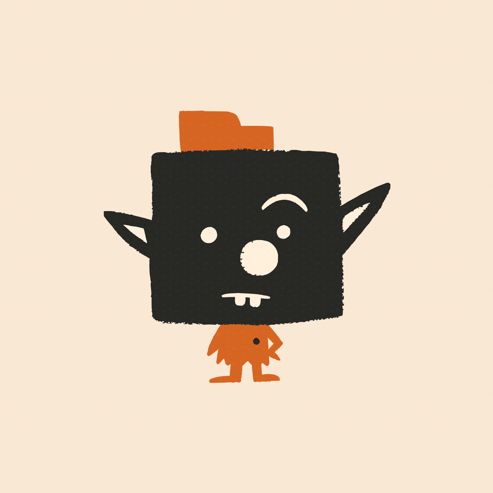

  

<h1 align="center">Debrute</h1>

<a href="./README.md">English</a>

Debrute 是一个本地创意生产工作台，面向 AI agent 生成的图片、视频、音频、文档和设计参考文件。

Debrute 基于一个简单判断：最好的 agent 已经存在，最好的专业创意软件也已经存在。Debrute 不试图替代任何一边。它要做的是给 agent、设计师和创意团队一个共享空间，用来生成、查看、组织、对比、标注、挑选和交接生产资源。

## Debrute 为什么存在

现代 agent 已经很擅长规划、写提示词、调用工具、生成资产和编辑文件。真正不顺畅的地方，是 agent 的文件系统操作和人的视觉判断之间的空间。

生成资产通常是二进制的、视觉化的、带版本的，而且很容易变得混乱。它们需要被看见、比较、否定、标注、挑选，并交给专业工具继续处理。终端记录不够，文件夹树不够，聊天里的单个附件也不够。

Debrute 把一个本地项目文件夹变成 agent 能读、人也能看的生产空间。

## Debrute 是什么

- 一个用于生成生产资产的本地工作台。
- 一个用于查看项目文件、资产变体、文件夹结构和反馈的可视化 Canvas。
- 一个基于真实本地文件夹的项目模型，而不是需要导入的云端工作区。
- 一个连接外部 agent、生成文件和专业设计工具的桥梁。
- 一个命令和 Skills 接口，让 agent 能调用 Debrute，但不必变成 Debrute 专属 agent。

Debrute 适合那些文件系统结构很重要的项目。你可以指挥 agent 创建文件夹、提示词、参考资料、输出结果、替代方案和最终选择。文件夹层级本身会成为项目逻辑的一部分：一种轻量表达分组、顺序、对比和意图的方式。

## Debrute 不是什么

Debrute 不是 agent。

市场上已经有很多强大的 agent，而且它们会继续快速进化。Debrute 不实现自己的规划器、代码助手、创意总监或自动化工作流引擎。你可以使用自己喜欢的 agent，安装需要的 Skills，然后让这个 agent 把 Debrute 当作项目和资产工作台。

Debrute 不是工作流系统。

它不强迫你使用固定的生产流程，也不规定你应该如何构思、生成、排序、编辑、批准或发布。agent 和人可以通过文件、文件夹、Canvas Map、提示词和正常的项目约定来表达这些选择。

Debrute 也不是 Photoshop、Blender、Premiere、Figma 或其他专业创意软件的替代品。

AI 生成无法替代专业编辑工具的精度、控制力和专业经验。凡是这些专业工具已经擅长的能力，Debrute 都会刻意避免重复实现。对于专业设计师来说，Debrute 是用来生成、收集、查看、对比和挑选资源的地方，然后再把选中的资产带入专业软件继续处理。当前仓库包含用于在 Debrute 和 Photoshop 之间移动资产的 Photoshop 插件。

## 与 Agent 配合

Debrute 不限制 agent。它最推荐搭配具备内置浏览器的 agent GUI 项目使用，因为 agent 可以打开 Debrute Workbench、查看 Canvas 状态、理解视觉反馈，然后在同一个循环里更新项目文件。

建议优先评估这些例子：

- [Codex](https://developers.openai.com/codex/app/browser)
- [Qoder](https://docs.qoder.com/user-guide/chat/browser-agent)
- [Cursor](https://cursor.com/docs/agent/tools/browser)
- [Google Antigravity](https://www.antigravity.google/docs/browser)

所有 CLI agent 也都可以使用 Debrute。Debrute 提供命令接口和官方 Skills，让外部 agent 可以启动 Workbench、校验项目、推送 Canvas Map、请求生成、查询生成资产元数据。

## 与设计师配合

Debrute 应该位于专业编辑软件之前和旁边，而不是位于它们之上。

设计师可以把 Debrute 当作资源台：生成大量候选项，把参考资料放在旁边，标记有价值的结果，否定不合适的结果，给精确视觉区域添加批注，对比不同变体，然后把选中的资产带入 Photoshop 或其他专业编辑器。

当前仓库包含 UXP 和 CEP Photoshop 插件，它们共用同一套 Debrute Bridge 协议。

## 项目模型

一个 Debrute 项目就是你的本地文件夹，加上 `.debrute/` 下的 Debrute 元数据。

本地文件夹仍然是事实来源。agent 可以使用普通文件系统工具创建项目结构、提示词、参考资料、生成输出和最终资产。Debrute 在这个文件夹之上增加可视化层，让人和 agent 能看到同一个项目形状。

Canvas Map 定义哪些项目文件会出现在某个 Canvas 上。Canvas 则成为用于查看、对比、挑选和反馈的共享视觉表面。

## 官方 Skills

Debrute 提供面向外部 agent 的标准 Skills：

- `debrute-core`：项目语义、Workbench URL、Canvas Map 推送、生成资产和基于模型的生成。
- `debrute-image-director`：通过 `debrute` 命令进行图片生成和编辑。
- `debrute-video-director`：通过 `debrute` 命令进行视频生成和编辑。
- `debrute-audio-director`：通过 `debrute` 命令进行 TTS、音乐生成和音效生成。

这些 Skills 说明如何调用 Debrute。它们不是隐藏 API，也不会替代 agent 自己的工具能力。

## 技术文档

README 会刻意保持简短。技术细节在这里：

- [技术文档索引](./docs/README.md)
- [领域上下文图](./CONTEXT-MAP.md)
- [开发](./docs/development.md)
- [产品模型](./docs/product-model.md)

## License

Debrute 使用 Apache License, Version 2.0 授权。详见 [LICENSE](./LICENSE)。
